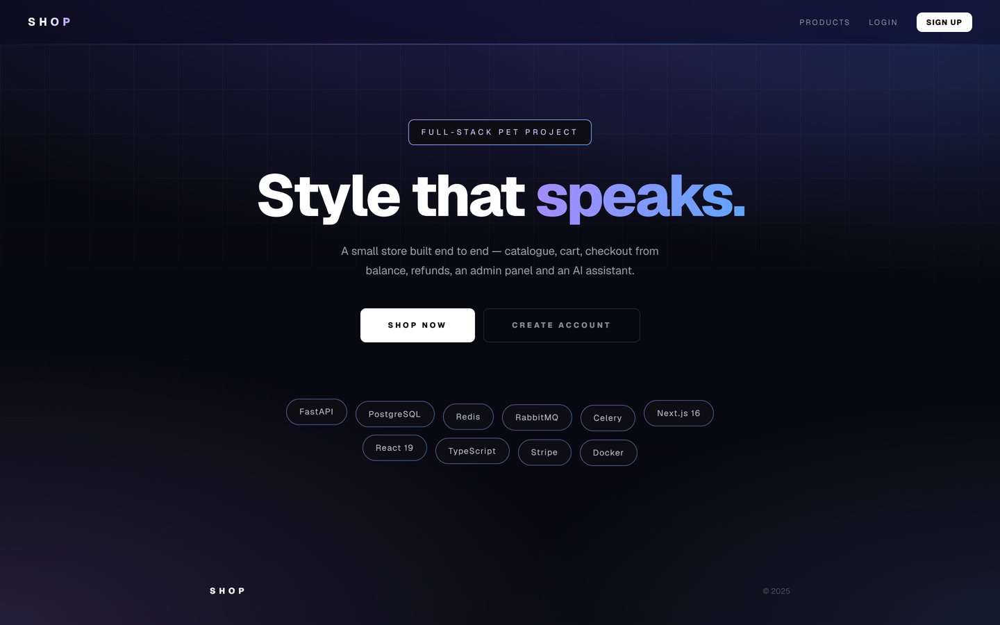

# E-Commerce Frontend

**Modern e-commerce storefront** built with Next.js 16, React 19 and TypeScript.  
Connected to a [FastAPI backend](https://github.com/bogdan0089/fastapi-ecommerce-backend) — full API reference available there.

**▶ Live store:** https://shop.bondanweb.duckdns.org — Stripe test card `4242 4242 4242 4242`
**Backend repo:** https://github.com/bogdan0089/fastapi-ecommerce-backend · [live API docs](https://shop-api.bondanweb.duckdns.org/docs)



---

## Stack

- Next.js 16 (App Router) + React 19 + TypeScript
- Stripe.js + `@stripe/react-stripe-js` — card payment UI
- Fetch API — every call typed in `lib/api.ts`
- Design tokens in `lib/theme.ts`, shared components in `components/` — styles are
  written inline, but no page holds a raw colour value
- Tailwind is installed and imported by `globals.css`; it is not used for layout
- Docker — standalone Next server (`output: "standalone"`): the image carries the server and only the packages it imports
- Caddy — reverse proxy with automatic HTTPS

---

## How to Run Locally

**1. Clone and install**
```bash
git clone https://github.com/bogdan0089/ecommerce-frontend.git
cd ecommerce-frontend
npm install
```

**2. Configure environment**

Create `.env.local` in the project root:
```env
NEXT_PUBLIC_API_URL=http://localhost:8000
NEXT_PUBLIC_WS_URL=http://localhost:8000
NEXT_PUBLIC_STRIPE_KEY=pk_test_...
```

Unset, all three fall back to a local backend on port 8000, so a fresh clone runs
against your own stack and never against someone else's server.

`NEXT_PUBLIC_WS_URL` is deliberately separate from `NEXT_PUBLIC_API_URL`: behind a
proxy that serves HTTP under `/api` and passes `/ws` straight through, the two bases
differ. Locally both are `http://localhost:8000`.

**3. Run**
```bash
npm run dev
```

App: `http://localhost:3000`

> Requires the [FastAPI backend](https://github.com/bogdan0089/fastapi-ecommerce-backend)
> running on port 8000. Its routers are mounted at the root — no `/api` prefix locally.

**Other commands**
```bash
npm run build      # production build
npm start          # serve the build
npm run lint       # ESLint
npx tsc --noEmit   # type check
```

There is no test suite. CI (`.github/workflows/ci.yml`) runs lint, type check and build
on every push and pull request to `main` and `dev`.

---

## Pages

| Route | Description |
|-------|-------------|
| `/` | Landing page |
| `/login` | Login, with a resend-verification action when the email is unconfirmed |
| `/register` | Registration + email verification flow |
| `/forgot-password` | Request password reset |
| `/reset-password` | Reset password via token |
| `/auth/verify/[token]` | Email verification |
| `/products` | Catalog with search, category filter, price slider; AI search once signed in |
| `/products/[id]` | Product detail page |
| `/cart` | Shopping cart (localStorage) |
| `/checkout` | Order checkout |
| `/profile` | Profile with 6 tabs: overview, orders, edit, deposit, security, AI |
| `/transactions` | Transaction history |
| `/admin` | Admin panel (superadmin / moderator only) |

---

## Features

**Authentication**
- Register with email verification; the link can be resent from login or registration
- JWT access + refresh token in localStorage; an expired access token is refreshed
  automatically and the request retried, so a session does not die mid-action
- Forgot / reset password by email
- Change password and delete account from the profile

**Products**
- Catalog with search by name, category filter and a max-price slider
- AI search by description for signed-in users ("something quiet for the office")
- Product detail page with colour, stock and quantity selector
- Cart in localStorage, shared through one store so the header count is always live

**Checkout & Orders**
- Cart → create order → add products → checkout, paid from the account balance
- A half-built order is cancelled if checkout fails, so no drafts are left behind
- Items that disappeared from the catalogue are skipped and reported, not silently ordered
- Order history in the profile, expandable to products and quantities

**Profile**
- **Overview** — account info and quick links
- **Orders** — history with status badges
- **Edit profile** — name, age, address
- **Deposit** — Stripe card payment, plus a clearly labelled demo top-up that credits
  the balance without taking money, so the checkout flow can be tried without a card
- **Security** — change password, delete account
- **AI** — personalised recommendations and a store assistant

**Admin panel** (superadmin / moderator)
- **Products** — filter by status, create / edit / delete, approve / reject, AI-generated
  descriptions
- **Orders** — complete, cancel or refund
- **Categories** — create and delete
- **Stats** — totals, breakdowns by status, recent clients
- Live WebSocket notifications when a client checks out

**Forms**
- Browser validation bubbles are replaced with inline messages. The rules still come
  from the markup — the Constraint Validation API is read back, so nothing is written
  twice.

---

## Project Structure

```
app/
├── page.tsx                       # Landing page
├── globals.css                    # Resets, focus rings, keyframes, page shells
├── layout.tsx
├── login/  register/  forgot-password/  reset-password/
├── auth/verify/[token]/
├── products/page.tsx              # Catalog
├── products/[id]/page.tsx         # Product detail
├── cart/  checkout/  transactions/
├── profile/page.tsx               # 6 tabs
└── admin/page.tsx                 # 4 tabs
components/
├── ui.tsx                         # Button, Input, Field, Card, Alert, Badge, Tabs, ...
└── nav.tsx                        # Nav, CartButton, LogoutButton, Page, AuthShell
lib/
├── api.ts                         # Typed API calls, token refresh, error status
├── theme.ts                       # Colours, radii, widths — the only place they live
├── cart.ts                        # Cart store over localStorage
├── useAuth.ts                     # Login state store
└── formErrors.ts                  # Inline validation
```

---

## Deployment

```bash
docker build \
  --build-arg NEXT_PUBLIC_API_URL=https://shop-api.example.org \
  --build-arg NEXT_PUBLIC_WS_URL=https://shop-api.example.org \
  --build-arg NEXT_PUBLIC_STRIPE_KEY=pk_test_... \
  -t ecommerce-frontend .

docker run -d --restart always -p 127.0.0.1:3000:3000 ecommerce-frontend
```

The `NEXT_PUBLIC_*` values are build arguments, not runtime variables — Next inlines
them into the browser bundle while building, so pointing the storefront at a different
API means rebuilding the image.

The container binds to loopback; a proxy on the host terminates TLS:

```caddy
shop.example.org {
    reverse_proxy 127.0.0.1:3000
}
```

---

## Conventions

- No comments in source files; anything that needs explaining is documented here. The
  only `//` lines are tooling directives such as `eslint-disable-*` — removing those
  turns CI red.
- Never call `setState` synchronously inside a `useEffect` body — derive with `useMemo`,
  clamp during render, or use `useSyncExternalStore`. ESLint enforces this.
- Product images are arbitrary admin-supplied URLs, so `next/image` is not used.
